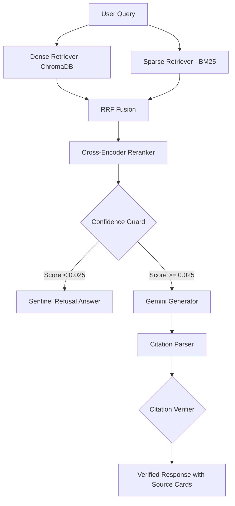

# ⚡ Retryv — Production-Grade RAG Pipeline

Retryv is a production-grade Retrieval-Augmented Generation (RAG) system built over FastAPI's official documentation. It implements hybrid retrieval, reciprocal rank fusion (RRF), Cross-Encoder reranking, and citation verification to deliver grounded and factual answers with verifiable sources.

---

## 🏗️ System Architecture

The following diagram outlines the end-to-end pipeline mapping user queries to verified responses:



### Key Engineering Features

1. **Hybrid Retrieval**: Employs dual-stage search matching semantic intent (Dense via ChromaDB & `gemini-embedding-001`) with exact keywords (Sparse via `rank_bm25`).
2. **Reciprocal Rank Fusion (RRF)**: Merges dense and sparse rankings mathematically (`rrf_k=60`) to improve candidate diversity.
3. **Cross-Encoder Reranking**: Uses local `cross-encoder/ms-marco-MiniLM-L-6-v2` to rerank a deep candidate pool (depth=20) down to the top 5 most relevant chunks, boosting precision and recall.
4. **Pre-Generation Confidence Guard**: Implements a calibrated retrieval threshold check (`threshold=0.025`) before calling the generator, skipping LLM API calls entirely for irrelevant queries.
5. **Inline Citations & Gemini-as-Judge Verification**: Automatically parses references (e.g. `[1]`) from the generated answer and verifies them using Gemini as an independent evaluator (`SUPPORTED` vs `NOT_SUPPORTED`).

---

## 📊 Final Evaluation Benchmark Results

The system was evaluated against a golden dataset of 52 queries covering lookup, multi-hop, ambiguous, and unanswerable topics (Reranker active, 52 queries total):

| Metric | Fixed-Size | Structure-Aware | Semantic |
| :--- | :---: | :---: | :---: |
| **Retrieval Recall** | 0.8141 | **0.8365** | 0.7596 |
| **Retrieval Precision** | **0.2952** | 0.2804 | 0.2641 |
| **Citation Accuracy** | 0.2733 | 0.3718 | **0.4340** |
| **Faithfulness** | 0.2194 | **0.3205** | 0.2807 |
| **Answer Correctness** | **0.4712** | 0.4269 | 0.3625 |

### Takeaways
* **Structure-Aware Chunking** splits text based on markdown headers and maintains hierarchical contexts, achieving the highest overall **Recall (83.65%)** and **Faithfulness (32.05%)**.
* **Semantic Chunking** uses sentence similarity splits to group unified concepts together, achieving the highest **Citation Accuracy (43.40%)**.
* **Fixed-Size Chunking** cuts texts arbitrarily, leading to lower citation accuracy and faithfulness as concepts get truncated.

---

## ⚙️ Local Setup & Installation

### Prerequisites
* Python 3.12+
* Google Gemini API Key (obtained from [Google AI Studio](https://aistudio.google.com/))

### 1. Clone the repository and install dependencies
```bash
git clone <repository-url>
cd Retryv
python -m venv .venv
source .venv/bin/activate  # On Windows: .venv\Scripts\activate
pip install -r requirements.txt
```

### 2. Configure Environment Variables
Create a `.env` file in the root directory:
```env
GEMINI_API_KEY="your-gemini-api-key-here"
```

> [!IMPORTANT]
> **Free-Tier Rate Limits & Ingestion/Evaluation Pacing**
> The default Gemini free-tier has a limit of **15 RPM (Requests Per Minute)**. The ingestion and evaluation runs execute sequential requests. To prevent rate limits (`429 Resource Exhausted` errors):
> * Always specify a `--sleep 1.0` or `--sleep 2.0` parameter when running evaluations.
> * If you hit a daily quota limit, the execution will pause or fail; wait for the quota window to reset and resume.

---

## 🚀 Running the Application

### 1. Build & Index Documents
Run the full ingestion pipeline to load raw FastAPI markdown files, generate chunks, embed, and index them into ChromaDB and BM25:
```bash
# Deletes old databases and re-indexes all 3 strategies from scratch
python scripts/reindex_all_strategies.py
```
If you only need to rebuild the BM25 pickled indexes from existing database collections (without calling the Gemini Embedding API):
```bash
python scripts/rebuild_bm25.py
```

### 2. Run Evaluation Benchmarks
Run the evaluation suite over the 52 golden queries for any strategy:
```bash
python scripts/run_eval.py --strategy fixed_size --sleep 1.0
python scripts/run_eval.py --strategy structure_aware --sleep 1.0
python scripts/run_eval.py --strategy semantic --sleep 1.0
```
Compare the generated reports:
```bash
python scripts/compare_eval_reports.py
```

### 3. Launch the API & Web Demo
Start the FastAPI backend server:
```bash
uvicorn app.main:app --reload
```
In a separate terminal, launch the Streamlit frontend:
```bash
streamlit run streamlit_app/app.py
```
Open your browser and navigate to `http://localhost:8501` to use the interactive dashboard.
